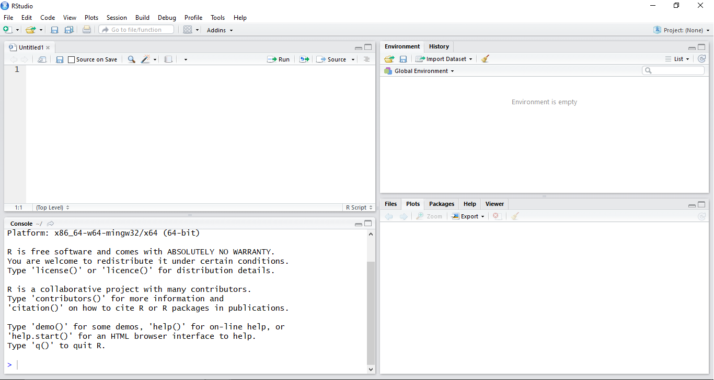

# R e RStudio {#R_e_RStudio}

Antes de introduzir o leitor ao mundo do R gostaria de parabenizá-lo por aceitar o desafio de aprender um linguagem de programação que o ajudará a realizar seus trabalhos. Então, parabéns! 

## O que são {#o_que_sao}

R é uma liguagem de programação estatística baseada em comandos de linha, de modo que é dado ao usuário uma liberdade e flexilibidade na hora de fazer as análises. O RStudio é um ambiente de programação que torna mais fácil e eficiente a utilização do R. De maneira simples podemos descrever o funcionamento do R como   


Para baixar e instalar o R acesse o site do R Project ([https://www.r-project.org/](https://www.r-project.org/)), clique em *download R* e em seguida escolha um dos *mirrors* brasileiros, a figura \@ref(fig:baixar-r) sintetizaos passos. O próximo passo é apenas executar o arquivo baixado. 

```{r baixar-r,fig.cap="Baixando o R", echo=FALSE}
include_graphics(c("images/_baixar_r_1.png","images/_baixar_r_2.png"))
```

Já o RStudio é um ambiente que torna a utilização da linguagem R mais agradavél e possibilita uma organização muito boa da análise que está sendo feita. Para baixar o RStudio acesse o site do RStudio ([https://www.rstudio.com/](https://www.rstudio.com/)), clique no icone *Download RSstudio*, em seguida clique em *Desktop Open Source License* e por fim basta executar o arquivo baixado, a figura \ref@(fig:baixar-rstudio) sintetiza os passos.
```{r baixar-rstudio, fig.cap="Baixando o RStudio",echo=FALSE}
include_graphics(c("images/_baixar_rstudio_1.png","images/_baixar_rstudio_2.png"))
```

É importante destacar que **a ordem de instalação deve ser respeitada,isto é, primeiro instalr o R e depois o RStudio**.

## *Layout* do RStudio {#layout_rstudio}

Depois de instalar o R e RStudio abra o RStudio, pois como comentado anteriorment o RStudio é um ambiente que torna mais eficiente a programação em R, e desse modo utilizaremos ele como interface para usar o R. Ao abrir o RStudio você deve se deparar com o *layout* apresentado na figura \@ref(fig:layout-rstudio).
```{r layout-rstudio, echo=TRUE,fig.cap="Layout do RStudio"}

```

Esse *layout* apresenta 4 janelas principais para se usar o R no RStudio. De maneira sucinta: 

1. A janela superior esquerda é o *script* que, como veremos em seguida, é onde nós escrevemos o código para ser executado; 
2. A janela superior direita, chamada de *environment*, é onde estão      
