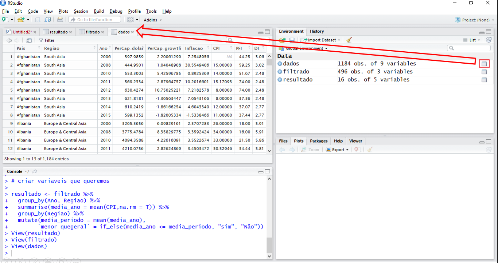

# Primeiros Comandos no R {#primeiros_comandos_no-R}

Agora que apresentamos o R e RStudio e o básico sobre seu funcionamento, vamos começar nossa aventura dentro das linhas de comando do R apresentando...

Neste capitulo usaremos os os pacotes
```{r}
library(tidyverse)
library(DadosLivroR)
```


## R como calculadora {#r_como_calculadora}

A utilização mais trivial que se pode fazer do R é como uma calculadora. Onde podemos fazer operações "comuns", como soma, multiplicação, exponenciação e etc. A execução das operações comuns é muito intuitiva, se quisermos somar números utilizamos o símbolo `+`, dividir usamos `/`, exponenciação usamos `^`. Porém há outros tipos de operações^[Estamos chamando de operações pois é uma maneira mais direta de se entender, sob uma perspectiva formal matemática seria incorreto utilizar essa nomeclatura] que podemos fazer que isoladamente são simples, mas que são muito úteis no processo de análise de dados. 

O primeiro tipo é o que chamamos de testes de igualdade. São operações que testam se duas variáveis são iguais, se uma é menor ou maior que a outra. Diferente das operações comuns que retornam valores númericos, essa operações retornam valores lógicos de `TRUE` para verdadeiro e `FALSE` para falso, valores lógicos são apresentados devidamente na seção \@ref(tipos_de_dados). Então ao executar o comando `2 == 3` o resultado exibido será `FALSE` e ao executar o comando `2 <= 3` retornará um resultado `TRUE`, pois é claro que 2 não é igual a 3 e é menor que 3. Como pode se verificar abaixo

```{r}
2==3
2<=3
```

Isso pode parecer bobo, mas toda a estatística que tradicionalmente se aprende em um curso de graduação^[Estatística inferentista] é baseado em testes de hipótese que em termos práticos é verificar se o p valor de uma estatística é menor do que $1-nível\ de\ significância\ escolhido$^[Colocar aqui explicação sobre o significado do alpha e intervalo de confiança em termos dos tipos de erro I e II]. Ou seja, podemos automatizar decisões através de testes de igualdade. 

O outro tipo de operação é chamada de connectivos/operadores lógicos. Da mesma maneira que os testes de igualdade os operadores lógicos retornam valores `TRUE`ou `FALSE`. Há três operadores importantissímos, são eles o ` E` que retorna `TRUE` caso as duas condições sejam verdadeiras e `FALSE` caso contrário. O `OU` que retorna `TRUE` caso uma das duas condições seja verdadeira e `FALSE` caso contrário. E o `negação` que retorna `TRUE` caso a condição seja falsa e `FALSE` caso a condição seja verdadeira. É importante parar um pouco e refletir sobre o que isso significa para ter certeza que você entendeu, e para ajudá-lo a compreendeer e mostrar os símbolos dos operados no R vamos analisar um exemplo detalhado. A tabela \@ref(tab:calculadora-r) traz resumidamente os principais operadores do R.

```{r calculadora-r, echo=FALSE}
tab <- matrix(nrow = 11, ncol = 3)
colnames(tab) <- c("Operação","Descrição","Resultado")
tab[,1] <- c("x + y","x - y","x * y","x / y","x ^ y", "x == y","x <= y", "x >= y", "x & y", "x | y", " !x ")

tab[,2] <- c("Soma y ao x", "Subtrai y de x","Multiplica x, y vezes", "Divide x por y", "Eleva x à y potência","Testa se y é igual a x", "Testa se y é menor ou igual a x", "Testa de y é maior ou igual a x", "Operador lógico 'E'", "Operador lógico 'OU'","Operador lógico de negação")
tab[,3] <- c(rep("Número",5),rep("TRUE/FALSE",(nrow(tab)-5)))

kable(tab,row.names = F,caption = "Principais Operadores do R")
```

```{example, operador-logico ,name="Utilização dos operadores de teste e lógicos"}

O principal objetivo deste exemplo é mostrar uma aplicação de como os operadores de teste e lógicos são usados no precessso dentro do R para facilitar o processo de análise de dados. A motivação do exemplo será mostrar comparar a percepção da corrupção na América Latina e Caribe com a percepção de corrupção na África Subsahariana. Espeficicamente vamos usar o índice de percepção de corrupção para os anos de 2006 a 2015, sem os anos de 2007 e 2009 para verificar se a percepção de corrupção na América latina é maior ou menor do que na África e verificar se há algum comportamente em comum ao longo do tempo nas médias de percepção de corrupção. O índice de percepção de corrupção varia entre 0 e 100 e quanto mais próximo de 100 menor é a percepção de  corrupção.

O exemplo pode ser desmontado nos seguintes passos: (i) carregar pacotes; (ii) Selecionar dados; (iii) Filtrar os dados; (iv) Criar variaveis que queremos; e (v) Ver os resultados
```

Vamos carregar os pacotes que usaremos:
```{r, eval=FALSE}
library(tidyverse)
library(DadosLivroR)
```

Agora vamos selecionar o data set chamada `data_set1` do pacote `DadosLivroR` e visualizar o início dele. Para obter uma descrição do data set digite `?data_set1` no console. Ainda não apresentamos a função `<-`, mas a grosso modo sempre que você se deparar com `x <- 2` leia como "x recebe 2", onde vamos chamar o que estiver o lado esquerdo do `<-` de "objeto daqui para frente. No caso do *chunk* abaixo seria "dados recebe data_set1", desse modo você pode usar o data_set1 sempre que precisar chamando o objeto `dados`. 
```{r}
# pegando os dados
dados <- data_set1

head(dados)
```

Em seguida vamos **filtrar** os dados e selecionar as variaveis que iremos trabalhar. Vamos selecionar as regiões da américa latina e África subsahariana e as variaveis relacionadas à região, ao ano e CPI que é índice de percepção de corrupção. O código abaixo faz isso:
 
```{r}
filtrado <- dados %>% 
  filter(Regiao == "Latin America & Caribbean" | Regiao == "Sub-Saharan Africa") %>% 
  select(Regiao, Ano, CPI)
```

Onde tiver `%>%` leia "então". Deste modo o *chunk* acima está fazendo o seguite: pegando o objeto dados, então filtrando a coluna Regiao para valores que sejam iguais à "Latin America & Caribbean" **OU** iguais à "Sub-Saharan Africa", então selecionando as colunas com o nome de Regiao, Ano e CPI e salvando o resultado em um objeto chamado `filtrado`. Veja que aqui utilizamos o operador lógico OU para fazer o filtro, `filter(Regiao == "Latin America & Caribbean" | Regiao == "Sub-Saharan Africa")`!

Antes de prosseguirmos, vamos verificar o data frame filtrado:
```{r}
filtrado
```

Vemos que temos o que queremos. Agora basta calcularmos as médias de cada ano para cada uma das regiões e depois a média geral de cada grupo:
```{r}
resultado <- filtrado %>% 
  group_by(Ano, Regiao) %>% # agrupando por Ano e Regiao
  summarise(media_ano = mean(CPI,na.rm = T)) %>% # Calculando media
  group_by(Regiao) %>% # Agrupando por regiao
  mutate(media_periodo = mean(media_ano), # criando media por ano
                      `menor que periodo` = if_else(media_ano <= media_periodo, "sim", "Não"))

```
Que resulta no seguinte:

```{r, results='asis',echo=FALSE}
kable(resultado)
```


Neste último *chunk* pegamos o objeto `filtrado`, então agrupamos por Ano e Regiao, então calculamos a média do CPI (índice de percepção de corrupção), então agrupamos por Regiao, então adicionames duas variáveis: (i) media_periodo que tem a média do CPI para todo o período de cada região; e (ii) menor do que período que diz se a média no ano específico é menor ou não do que a média geral. E perceba que na última linha usamos o teste de igualdade para computar o valor da última variável,`if_else(media_ano <= media_periodo, "sim", "Não")`, o que essa linha fez comparar linha por linha se o valor da coluna "media_ano" é menor que o o valor "media_periodo" e caso o valor fosse menor então a coluna "menor que periodo" recebia o valor "sim" na respectiva linha, caso não fosse recebia o valor "não"! 

Não se preocupe em entender os detalhes do código, pois cada uma das ferramentas utilizadas serão propriamente apresentadas no decorrer do livro. O importante é que tenha ficado claro como os operados de teste e lógicos são utilizados. Outra coisa, pode parecer que é muito código, em um script seria apenas algo do tipo:
```{r, eval=FALSE}
library(DadosLivroR)
library(tidyverse)

# Pegar dados

dados <- data_set1

resultado <- dados %>% 
  filter(Regiao == "Latin America & Caribbean" | Regiao == "Sub-Saharan Africa") %>% 
  select(Regiao, Ano, CPI) %>% 
  group_by(Ano, Regiao) %>% 
  summarise(media_ano = mean(CPI,na.rm = T)) %>% 
  group_by(Regiao) %>% 
  mutate(media_periodo = mean(media_ano), 
                      `menor quegeral` = if_else(media_ano <= media_periodo, "sim", "Não"))
```

Vamos agora apresentar para o usuário como acessar os dados e variáveis que o leitor importa para o R. 

## *Workspace/Environment* {#workspace_environment}

Para entendermos o que é o *Workspace/Environment* vamos antes apresentar oficialmente o operador de atribuição `<-`. A utilizaçãp desse operador da-se da seguinte maneira `nome <- objeto`, onde `nome` é nome do `objeto`^[Ressaltamos aqui que o termo objeto não tem a mesma conotação que teria no caso de liguagens orientadas a objetos] que você quer salvar. Se olharmos o exemplo \@ref(exm:operador-logico) vemos que utilizamos o operador de atribuição três vezes para salvar os objetos `dados`, `filtrado` e `resultado`, ou seja nesse caso nossos objetos são data sets, mas poderiam ser várias outras coisas, como vetores, resultados de regressão, gráfico e etc.  Se olharmos o *Workspace/Environment* depois de executar o código do exemplo teremos algo como mostra a \@ref(fig:workspace-environment). Veja que temos nossos três objetos disponíveis para quando quisermos utiliza-los.

```{r workspace-environment, echo=FALSE,fig.cap="Exemplo de workspace/Environment"}
include_graphics("images/_workingspace.png")
```

Ao clicar com o botão esquerdo do mouse nas janelinhas no final da linha com o nome do objeto é aberta uma nova aba dentro do RStudio mostrando os dados. Veja a figura \@ref(fig:aba-com-dados).

```{r aba-com-dados, echo=FALSE,fig.cap="Vendo dados no RStudio"}

```

## Funções {#funcoes}

Uma função é um meio de se automatizar uma sequência de comandos, ao invés de executar um de cada vez. Isso é feito através de *inputs*, valores que o usuário fornece à função, e a função retornará um *output* que é o resultado da execução de diversos comandos executados com os *inputs*.

Um exemplo trivial é a função `mean()` que calcula a média de um determinado conjunto de número. Qual são os comandos que essa função automatiza? (i) somar cada elemento do conjunto, (ii) contar quantos elementos tem o conjunto e (iii) dividir a soma pelo númere de elementos. A sintaxe geral de uma função é `noma_da_função(argumentos)`. Desse modo, calcularíamos amédia da sequência `r 1:10` da sequinte maneira:
```{r}
mean(1:10)
```

Calcular a média é uma boa maneira de se apresentar o conceito de funções, mas o leitor deve ter em mente que as funções não se restringem a comandos simples como esse. 

